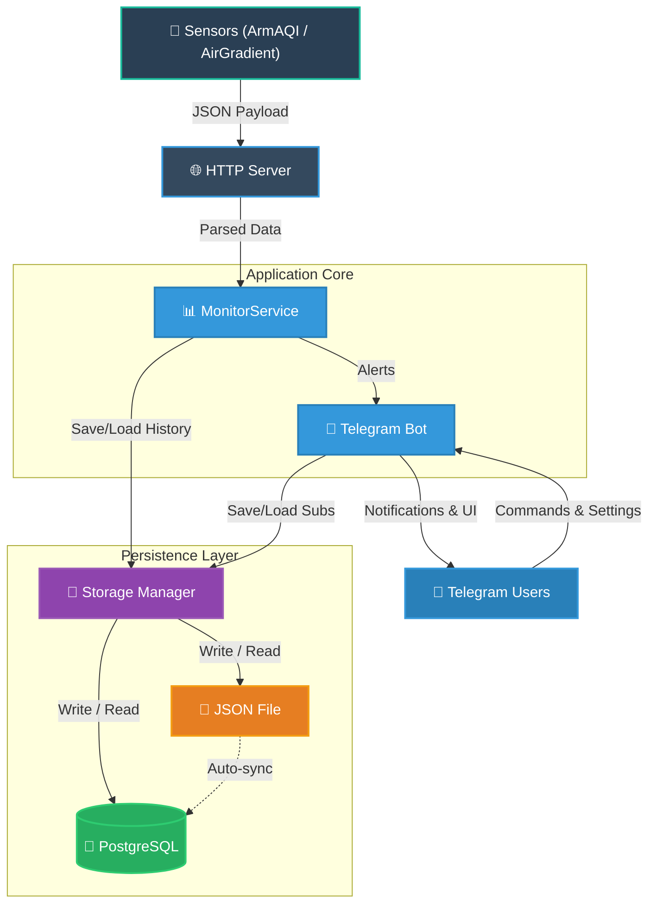

# AQI Notifier Bot

> 🇷🇺 [Документация на русском языке](README.ru.md)

A self-hosted Telegram bot that monitors air quality data from your personal sensors and sends smart, configurable notifications about pollution level changes and air quality trends.

---

## Overview

AQI Notifier receives real-time measurements from **ArmAQI** (SDS011-based, ESP8266) and **AirGradient** sensors, stores the data in PostgreSQL and/or JSON, calculates the Air Quality Index, and notifies subscribed Telegram users when pollution levels change. All configuration — thresholds, notification types, sensor correction formulas — can be updated without restarting the service.

---

## Features

### Sensor Support
- **ArmAQI** — ESP8266-based sensors with SDS011 (PM2.5/PM10) + BME280 (temperature, humidity, pressure)
- **AirGradient** — multi-metric sensors with PM1/PM2.5/PM10, CO₂, TVOC, NOx, temperature, humidity
- Auto-detection of sensor type based on payload format

### Calibration Engine
- Per-device-type correction formulas applied at ingest time
- Dependency-aware evaluation order (topological sort with circular dependency detection)
- Support for standard arithmetic, comparisons, and ternary expressions
- Formulas are hot-reloadable from the config file without service restart

### Notifications
Highly granular Telegram notifications for:
- **AQI level changes** (levels 1–7 across EU, US, and CN standards)
- **PM absolute zone transitions** — PM2.5 or PM10 entering/leaving Green, Yellow, or Red zones
- **PM relative dynamics** — sudden rises or drops (configurable % thresholds)
- **Notification delays (lazy mechanism)** — filter out flickering notifications on AQI boundary thresholds by delaying alerts until a new level remains stable for N consecutive measurements (configurable independently for rising and falling trends)
- Per-user notification preferences (enable/disable individual alert types)
- Per-user sound/silent mode for each alert type

### Telegram Bot
- Multi-user, multi-device subscriptions (each user subscribes to devices independently)
- Per-user settings: PM zone thresholds, AQI standard, temperature/pressure units, language
- Inline keyboard navigation — fully menu-driven, no slash commands required
- 24-hour chart generation for AQI, PM2.5/PM10, temperature, humidity, and pressure
- Device rename and unsubscribe management
- Settings reset to defaults

### Localization
- **Russian** and **English** interface (user-selectable in-bot)
- Template-driven rendering via a recursive JSON template engine
- All UI text, icons, colors, and AQI zone names are defined in JSON resource files
- New languages can be added by creating a corresponding JSON file

### Storage
- **PostgreSQL** (primary) + **JSON** file (always-on backup/fallback)
- Automatic migration of legacy data on startup
- Last N measurements per device kept in RAM for fast access

### Operations
- Hot config reload (polling interval configurable)
- Structured JSON logging with rotation support (via lumberjack)
- HTTPS support with configurable TLS certificate paths
- Deployable as a Windows service (included `deploy.ps1`)

---

## Architecture



---

## Quick Start

### Requirements
- Go 1.21+
- PostgreSQL (optional, JSON fallback available)
- A Telegram bot token from [@BotFather](https://t.me/BotFather)

### Build

```bash
git clone https://github.com/ABespalov/aqinotifier.git
cd aqinotifier
go build -o aqinotifier .
```

### Configure

Copy and edit the configuration file:

```bash
cp aqinotifier.yaml myconfig.yaml
```

Key settings to fill in:

```yaml
server:
  host: "0.0.0.0"
  port: 28288
  protocol: "https"          # or "http" for local testing
  file:
    cert: "server.pem"
    key:  "server-key.pem"

database:
  use:
    - postgres
    - json                   # fallback mode, or use only ["json"] for no-database mode
  file:
    pgsql: "aqinotifier.pgsql"
  max_values: 1500           # limit only when using json-only mode

tgbot:
  enabled: true
  token: "YOUR_BOT_TOKEN"    # or use file.token
```

### PostgreSQL Setup (optional)

Create a database and provide connection details in `aqinotifier.pgsql`:

```yaml
host: "localhost"
port: 5432
db: "aqin"
user: "aqinotifier"
password: "your_password"
sslmode: "disable"
```

### Run

```bash
./aqinotifier
```

The bot will start listening for sensor POST requests and Telegram messages.

---

## Sensor Calibration

Correction formulas are defined per device type in the config file. They are evaluated in dependency order, so a formula can reference another corrected field:

```yaml
monitor:
  corrections:
    ArmAQI:
      pm25: "1.85 * pm25_raw + 4.5"
      pm10: "?(1.9 * pm10_raw) < pm25 : pm25 : (1.9 * pm10_raw)"
```

**Formula syntax:**
- Standard arithmetic: `+`, `-`, `*`, `/`
- Ternary: `?condition : true_value : false_value`
- Available variables: `pm25_raw`, `pm10_raw`, `pm25` (after correction), `pm10` (after correction), etc.

The calibrated values are used for notifications and AQI calculation. Raw values are always stored separately for historical accuracy.

---

## Sensor Payload Format

### ArmAQI (ESP8266 + SDS011)

```json
{
  "esp8266id": "4021372",
  "software_version": "NRZ-2020-129",
  "sensordatavalues": [
    {"value_type": "SDS_P1", "value": "18.5"},
    {"value_type": "SDS_P2", "value": "12.3"},
    {"value_type": "BME280_temperature", "value": "22.1"},
    {"value_type": "BME280_humidity", "value": "58.0"},
    {"value_type": "BME280_pressure", "value": "101325"}
  ]
}
```

### AirGradient

```json
{
  "serialno": "ecda3b123456",
  "pm01": 4.0,
  "pm02": 7.5,
  "pm10": 9.2,
  "rco2": 612,
  "atmp": 23.4,
  "rhum": 55,
  "tvoc": 100,
  "nox": 1
}
```

Both payloads are accepted on the same endpoint. The type is detected automatically.

---

## Notification Types

| Category | Key Pattern | Description |
|---|---|---|
| AQI levels | `aqi_l1` … `aqi_l7` | AQI crosses into level N |
| PM absolute (up) | `val25_l2u`, `val10_l3u` | PM enters Yellow / Red zone |
| PM absolute (down) | `val25_l1d`, `val10_l2d` | PM drops to Green / Yellow zone |
| PM combined | `vals_l3u`, `vals_l1d` | Both PM2.5 and PM10 change together |
| PM dynamics (rise) | `diff25_l2u`, `diff10_l1u` | Sudden % rise in a zone |
| PM dynamics (fall) | `diff25_l1d`, `diff10_l2d` | Sudden % drop into a zone |

Each user can toggle any notification on/off and set its sound mode independently via the bot settings menu.

---

## AQI Standards

Supported calculation standards (user-selectable in-bot):

| Standard | Zones | Typical Use |
|---|---|---|
| **EU** | 1–6 (Good → Extremely Poor) | European CAQI |
| **US EPA** | 1–7 (Good → Hazardous) | US AQI |
| **CN** | 1–7 (Excellent → Hazardous) | China AQI |

---

## Configuration Reference

See the annotated [`aqinotifier.yaml`](aqinotifier.yaml) for the full configuration reference with inline comments.

---

## Resource Files

All UI text, icons, and AQI definitions are in the `res/` directory:

| File | Purpose |
|---|---|
| `res/ru.json` | Russian localization |
| `res/en.json` | English localization |
| `res/ico.json` | Icon definitions (emoji placeholders) |
| `res/colors.json` | Color mappings |
| `res/aqi.json` | AQI breakpoints per standard |
| `res/readme.en.md` | [Template engine documentation](res/README.md) |

---

## Tech Stack

| Component | Library |
|---|---|
| Telegram API | [mymmrac/telego](https://github.com/mymmrac/telego) |
| Formula evaluation | [expr-lang/expr](https://github.com/expr-lang/expr) |
| Charts | [go-analyze/charts](https://github.com/go-analyze/charts) |
| PostgreSQL | [lib/pq](https://github.com/lib/pq) |
| Logging | [rs/zerolog](https://github.com/rs/zerolog) + lumberjack |
| Config | gopkg.in/yaml.v2 |

---

## License

MIT
