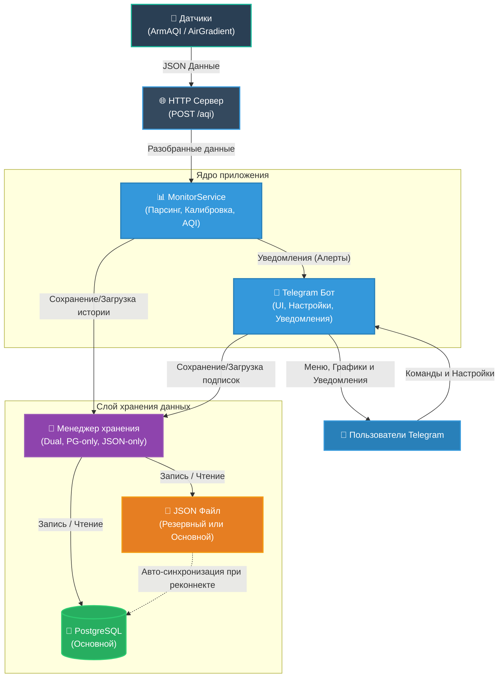

# AQI Notifier Bot

> 🇬🇧 [English README](README.md)

Самостоятельно размещаемый Telegram-бот для мониторинга качества воздуха по данным персональных датчиков. Бот отслеживает показатели PM2.5 и PM10, рассчитывает индекс качества воздуха (AQI) и отправляет гибко настраиваемые уведомления при изменении уровней загрязнения.

---

## Обзор

AQI Notifier принимает данные в реальном времени от датчиков **ArmAQI** (на базе ESP8266 + SDS011) и **AirGradient**, сохраняет их в PostgreSQL и/или JSON-файл, рассчитывает AQI и уведомляет подписанных пользователей Telegram при изменении уровней загрязнения. Все настройки — пороги, типы уведомлений, формулы коррекции показаний датчиков — можно обновлять без перезапуска сервиса.

---

## Возможности

### Поддерживаемые датчики
- **ArmAQI** — датчики на ESP8266 с SDS011 (PM2.5/PM10) + BME280 (температура, влажность, давление)
- **AirGradient** — многопараметрические датчики с PM1/PM2.5/PM10, CO₂, TVOC, NOx, температурой и влажностью
- Автоматическое определение типа датчика по формату передаваемых данных

### Движок калибровки
- Формулы коррекции показаний задаются в конфигурационном файле отдельно для каждого типа устройства
- Порядок вычислений определяется автоматически (топологическая сортировка с обнаружением циклических зависимостей)
- Поддержка арифметики, сравнений и тернарных выражений
- Формулы обновляются «на лету» без перезапуска сервиса

### Уведомления
Гибкая система уведомлений Telegram:
- **Переходы уровней AQI** (уровни 1–7 по стандартам EU, US и CN)
- **Абсолютные переходы PM** — PM2.5 или PM10 входит в зону Зелёную/Жёлтую/Красную или покидает её
- **Динамика PM** — резкий рост или падение значений (пороги в % настраиваются)
- Настройки уведомлений на каждого пользователя (включение/отключение отдельных типов)
- Режим «со звуком» / «беззвучно» для каждого типа уведомлений

### Telegram-бот
- Многопользовательский режим, несколько устройств на пользователя
- Персональные настройки: пороги зон PM, стандарт AQI, единицы измерения температуры и давления, язык
- Полностью меню-управляемый интерфейс на inline-кнопках
- Генерация графиков за последние 24 часа: AQI, PM2.5/PM10, температура, влажность, давление
- Переименование устройств и управление подписками
- Сброс настроек до значений по умолчанию

### Локализация
- Русский и английский интерфейс (переключается прямо в боте)
- Рендеринг через рекурсивный JSON-шаблонизатор с поддержкой условий и форматирования
- Все тексты, иконки, цвета и названия зон AQI вынесены в JSON-файлы
- Добавить новый язык можно созданием одного JSON-файла

### Хранение данных
- **PostgreSQL** (основное хранилище) + **JSON-файл** (постоянный резервный слой)
- Автоматическая миграция исторических данных при запуске
- Последние N измерений по каждому устройству хранятся в RAM для быстрого доступа

### Эксплуатация
- Горячая перезагрузка конфигурации (интервал опроса настраивается)
- Структурированное JSON-логирование с ротацией файлов (lumberjack)
- Поддержка HTTPS с настраиваемыми путями к TLS-сертификатам
- Готов к работе как Windows-служба (включён `deploy.ps1`)

---

## Архитектура



---

## Быстрый старт

### Требования
- Go 1.21+
- PostgreSQL (опционально, доступен режим только с JSON)
- Токен Telegram-бота от [@BotFather](https://t.me/BotFather)

### Сборка

```bash
git clone https://github.com/ABespalov/aqinotifier.git
cd aqinotifier
go build -o aqinotifier .
```

### Конфигурация

Скопируйте и отредактируйте конфигурационный файл:

```bash
cp aqinotifier.yaml myconfig.yaml
```

Ключевые параметры для заполнения:

```yaml
server:
  host: "0.0.0.0"
  port: 28288
  protocol: "https"          # или "http" для локального тестирования
  cert_file: "server.pem"
  key_file:  "server-key.pem"

database:
  use:
    - postgres
    - json                   # режим резервного копирования, либо укажите только ["json"] для работы без СУБД
  pgsql_file: "aqinotifier.pgsql"
  max_values: 1500           # ограничение количества записей (только в режиме "json")

tgbot:
  enabled: true
  token: "ВАШ_ТОКЕН_БОТА"   # или используйте token_file
```

### Настройка PostgreSQL (опционально)

Создайте базу данных и укажите параметры подключения в `aqinotifier.pgsql`:

```yaml
host: "localhost"
port: 5432
db: "aqin"
user: "aqinotifier"
password: "ваш_пароль"
sslmode: "disable"
```

### Запуск

```bash
./aqinotifier
```

Сервис начнёт принимать POST-запросы от датчиков и сообщения от пользователей Telegram.

---

## Коррекция показаний датчиков

Формулы коррекции задаются в конфигурационном файле отдельно для каждого типа устройства. Вычисляются в порядке зависимостей, поэтому одна формула может ссылаться на уже скорректированное поле:

```yaml
monitor:
  corrections:
    ArmAQI:
      pm25: "1.85 * pm25_raw + 4.5"
      pm10: "?(1.9 * pm10_raw) < pm25 : pm25 : (1.9 * pm10_raw)"
```

**Синтаксис формул:**
- Стандартная арифметика: `+`, `-`, `*`, `/`
- Тернарный оператор: `?условие : значение_если_истина : значение_если_ложь`
- Доступные переменные: `pm25_raw`, `pm10_raw`, `pm25` (после коррекции), `pm10` (после коррекции) и др.

Откорректированные значения используются для расчёта AQI и генерации уведомлений. Сырые значения всегда сохраняются отдельно для точности исторических данных.

---

## Формат данных от датчиков

### ArmAQI (ESP8266 + SDS011)

```json
{
  "esp8266id": "4021372",
  "software_version": "NRZ-2020-129",
  "sensordatavalues": [
    {"value_type": "SDS_P1", "value": "18.5"},
    {"value_type": "SDS_P2", "value": "12.3"},
    {"value_type": "BME280_temperature", "value": "22.1"},
    {"value_type": "BME280_humidity", "value": "58.0"},
    {"value_type": "BME280_pressure", "value": "101325"}
  ]
}
```

### AirGradient

```json
{
  "serialno": "ecda3b123456",
  "pm01": 4.0,
  "pm02": 7.5,
  "pm10": 9.2,
  "rco2": 612,
  "atmp": 23.4,
  "rhum": 55,
  "tvoc": 100,
  "nox": 1
}
```

Оба формата принимаются на одном endpoint. Тип определяется автоматически.

---

## Типы уведомлений

| Категория | Шаблон ключа | Описание |
|---|---|---|
| Уровни AQI | `aqi_l1` … `aqi_l7` | AQI переходит в уровень N |
| Абсолютный PM (рост) | `val25_l2u`, `val10_l3u` | PM входит в Жёлтую / Красную зону |
| Абсолютный PM (падение) | `val25_l1d`, `val10_l2d` | PM снижается до Зелёной / Жёлтой зоны |
| Оба PM | `vals_l3u`, `vals_l1d` | PM2.5 и PM10 изменяются одновременно |
| Динамика PM (рост) | `diff25_l2u`, `diff10_l1u` | Резкий рост PM в % в зоне |
| Динамика PM (падение) | `diff25_l1d`, `diff10_l2d` | Резкое падение PM в % в зоне |

Каждый пользователь может независимо включать/выключать любой тип уведомлений и настраивать режим звука через меню бота.

---

## Стандарты AQI

Поддерживаемые стандарты расчёта (выбираются пользователем в боте):

| Стандарт | Зоны | Применение |
|---|---|---|
| **EU** | 1–6 (Очень хорошо → Опасно) | Европейский CAQI |
| **US EPA** | 1–7 (Хорошо → Чрезвычайно опасно) | Американский AQI |
| **CN** | 1–7 (Отлично → Опасно) | Китайский AQI |

---

## Справочник по конфигурации

Полный справочник с комментариями — в файле [`aqinotifier.yaml`](aqinotifier.yaml).

---

## Ресурсные файлы

Все тексты интерфейса, иконки и данные AQI хранятся в директории `res/`:

| Файл | Назначение |
|---|---|
| `res/ru.json` | Русская локализация |
| `res/en.json` | Английская локализация |
| `res/ico.json` | Определения иконок (emoji-плейсхолдеры) |
| `res/colors.json` | Цветовые маппинги |
| `res/aqi.json` | Точки перехода AQI по стандартам |
| `res/readme.ru.md` | [Документация по шаблонизатору](res/README.ru.md) |

---

## Технологический стек

| Компонент | Библиотека |
|---|---|
| Telegram API | [mymmrac/telego](https://github.com/mymmrac/telego) |
| Вычисление формул | [expr-lang/expr](https://github.com/expr-lang/expr) |
| Графики | [go-analyze/charts](https://github.com/go-analyze/charts) |
| PostgreSQL | [lib/pq](https://github.com/lib/pq) |
| Логирование | [rs/zerolog](https://github.com/rs/zerolog) + lumberjack |
| Конфигурация | gopkg.in/yaml.v2 |

---

## Лицензия

MIT
